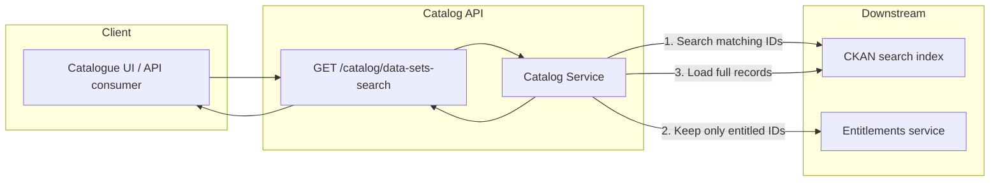
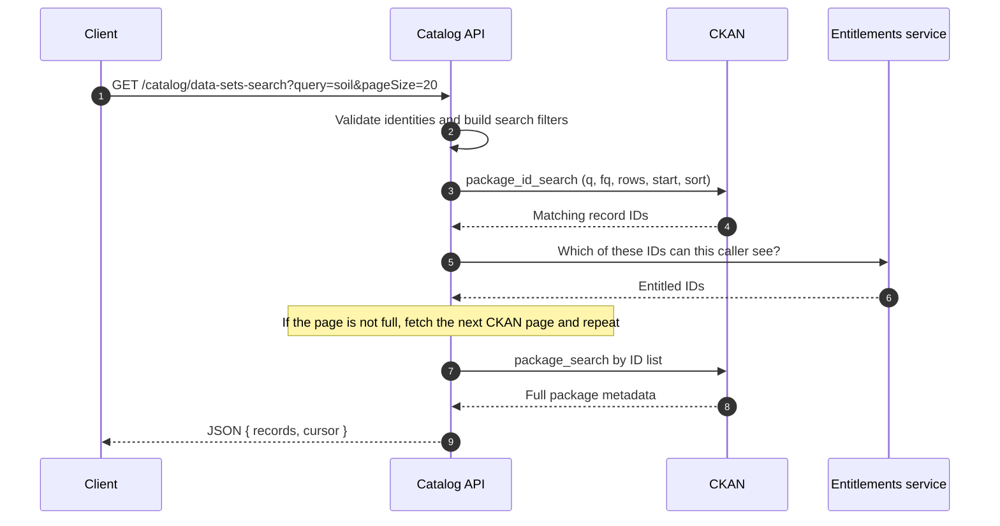

# Dataset Search — How DSP search Works

This page explains the search in business and technical terms: what the endpoint does, how it uses CKAN as the search index, and how access control is applied before results are returned.

---

## 1. What the client is seeing

When a user types a search term in the catalogue UI (for example “soil” or “weather”), the application calls:

```
GET /catalog/data-sets-search?query=<search term>&pageSize=<n>
```

The Catalog API does **not** store the searchable text itself. It:

1. Translates the request into a CKAN (Solr) search.
2. Asks CKAN for matching record **IDs**.
3. Checks **entitlements** so private or restricted records are not leaked.
4. Loads the full metadata for the allowed IDs from CKAN.
5. Returns a page of results plus a **cursor** for the next page.

The user only ever sees records they are allowed to access. Matching in CKAN does not automatically mean the record is returned.

---

## 2. High-level architecture



| Component | Role |
| --- | --- |
| **Catalogue UI / consumer** | Sends the search term, filters, and page size. |
| **Catalog API** | Orchestrates search, access control, pagination, and response mapping. |
| **CKAN** | Source of truth for catalogue metadata and full-text search (Solr). |
| **Entitlements service** | Decides which matched records the caller may actually see. |

---

## 3. End-to-end search flow



### Step by step

**Step 1 — Accept the request**
The API reads the search term (`query`), filters (tags, organisation, licence, exchange, dates, and so on), and pagination (`pageSize`, `cursor`). Lucene/Solr special characters in the search term are escaped so they are treated as text, not as query operators.

**Step 2 — Confirm who is searching**
If the caller is not an internal system user, search is scoped to identities they are allowed to use (typically `PUBLIC`, their user id, and their organisation ids). Requesting another organisation’s identity returns **403**.

**Step 3 — Search CKAN for matching IDs**
Filters and the free-text term are converted into CKAN Solr parameters (`q`, `fq`, `sort`, `rows`, `start`). CKAN returns IDs of packages that match — not yet the full metadata.

**Step 4 — Apply entitlements**
Each batch of IDs is checked against the entitlements service. Optional UI filters such as “show only my datasets” or “owned by user” are applied here, not in CKAN.

**Step 5 — Fill the page**
CKAN may return records the caller cannot see. The API keeps requesting the next CKAN page until it has `pageSize` entitled records (or CKAN has no more matches). The `cursor` is the CKAN offset to resume from.

**Step 6 — Load full records**
For the entitled IDs only, CKAN is asked for the full packages. Those are mapped into the catalogue search response shape.

**Step 7 — Return the response**
Default response is JSON: `{ records, cursor }`. Spreadsheet download is also supported when the client asks for Excel.

---

## 4. How the search term is sent to CKAN

The catalogue query parameter **`query`** is the free-text search (title, summary, description, tags, concepts, source).

That value is sent to CKAN as Solr parameter **`q`**, except:

| Catalogue request | What CKAN receives |
| --- | --- |
| `query=soil` | `q=soil` (full-text search) |
| `query=...&searchType=title` | Filter on title only (`fq`), not full-text `q` |
| `query=<dataset UUID>` | Filter on package id (`fq`) |

Other catalogue filters (tags, exchange, licence, dates, workflow keywords, and so on) become CKAN **filter queries (`fq`)**. They narrow the result set; they do not replace the search term.

### Example

Catalogue request:

```
GET /catalog/data-sets-search?query=weather&exchange=defra&tags=soil&pageSize=20
```

Equivalent CKAN search (IDs):

```
GET {CKAN_BASE}/api/3/action/package_id_search
    ?q=weather
    &fq=groups:defra_grp AND tags:("soil")
    &rows=20
    &start=0
    &sort=score desc
```

`{CKAN_BASE}` is the CKAN environment URL (for example the test catalogue host, or the production CKAN service).

When a free-text `query` is present, results are sorted by **relevance (`score desc`)** unless the client passes `orderby` (title, modified date, published date, metadata modified).

---

## 5. CKAN calls made during one search

A single catalogue search typically makes **two types** of CKAN call. A third call is used only for some users.

| # | CKAN action | Why | Searches the user’s term? |
| --- | --- | --- | --- |
| 1 | `package_id_search` | Find package IDs that match `q` / `fq` | **Yes** |
| 2 | `package_search` | Load full metadata for entitled IDs only | No — lookup by id |
| 3 | `package_search` (optional) | List records tagged as non-dataset resources, so they can be hidden from ordinary users | No |

Call 1 may run more than once if entitlements remove many matches and the page is not yet full.

Call 3 exists because some records (for example document-only / non-dataset resources) must remain visible to exchange admins and creators, but must not appear in the general catalogue search.

---

## 6. Access control (what the client can rely on)

Search is **not** “everything in CKAN that matches the text”.

| Control | Effect |
| --- | --- |
| **Identities** | Results are limited to records visible to `PUBLIC` and/or the caller’s user and organisations, unless an internal service identity is used. |
| **Entitlements** | A CKAN match is dropped if the caller has no entitlement on that resource. |
| **Exchange role** | Exchange admins and creators (and NCEA profile users) see a wider set, including some non-dataset resources. |
| **Private / hidden records** | Included in CKAN search only when `showHidden` is requested; still subject to entitlements. |

This is intentional: CKAN is the search index; the entitlements service is the access-control decision point.

---

## 7. Pagination

| Catalogue parameter | Meaning |
| --- | --- |
| `pageSize` | Number of entitled records to return (CKAN `rows` for each ID search page). |
| `cursor` | CKAN offset (`start`) to continue from. `0` if omitted. |

The cursor is **not** a secret token. It is the position in the CKAN result list after entitlements filtering. The client should pass the `cursor` from the previous response to load the next page.

Because some CKAN hits are removed by entitlements, one catalogue page may consume more than `pageSize` CKAN rows. That is expected and is why the cursor is based on CKAN position, not on “page number”.

---

## 8. Common request parameters (client-facing)

| Parameter | What it does |
| --- | --- |
| `query` | Free-text search term sent to CKAN as `q`. |
| `exchange` | Restricts search to an exchange group (for example Defra → CKAN group `defra_grp`). |
| `tags` / `keywords` | Filter by tags. |
| `organisation` | Filter by publisher / creator. |
| `licence`, `workflowKeywords`, `category`, `spatialCoverage` | Metadata filters (`fq`). |
| `orderby` | Sort: title, modified, published, or metadata date. Default with `query` is relevance. |
| `pageSize`, `cursor` | Pagination. |
| `identities` | Optional override of whose visibility to use (must be identities the caller is allowed to use). |
| `showMine` | Keep only records the caller owns (entitlements, not CKAN). |
| `showHidden` | Include private CKAN packages in the ID search. |
| `showRetiredAndArchived` | Include retired / archived published statuses. |

Default response format is **JSON**. Excel is available via content negotiation (`Accept` for spreadsheet) and `exportFileFormat` where required.

---

## 9. Example response shape

```json
{
  "records": [
    {
      "id": "<dataset-id>",
      "title": "Example dataset title",
      "description": "…",
      "tags": ["soil"]
    }
  ],
  "cursor": 20
}
```

Field names on each record follow the catalogue search schema (not the raw CKAN package document). CKAN packages are mapped before they leave the Catalog API.

---

## 10. Summary for stakeholders

- **Catalogue search is CKAN-backed.** The search term is executed as a CKAN Solr query (`package_id_search`).
- **CKAN finds candidates; entitlements decide visibility.** Matching text is not sufficient to appear in results.
- **Full records are loaded only for allowed IDs**, which keeps the search efficient and avoids exposing restricted metadata.
- **Pagination is CKAN-offset based**, so the next page continues from the correct place in the index after access filtering.
- **The Catalog API is the single integration point** for UI and other consumers; clients do not need to call CKAN or the entitlements service directly.

---

## Appendix — CKAN URL pattern

```
{CKAN_BASE}/api/3/action/package_id_search?q={searchTerm}&fq={filters}&rows={pageSize}&start={cursor}&sort={sort}
```

Then, for the entitled IDs:

```
{CKAN_BASE}/api/3/action/package_search?q=id:({id1} OR {id2} OR …)&rows={n}
```

`{CKAN_BASE}` is environment-specific and is configured on the Catalog API (`ckan.url`).
